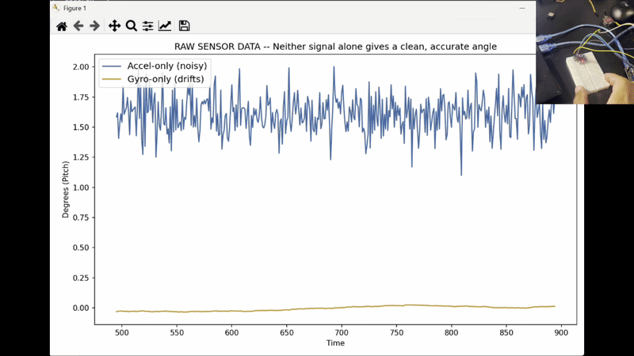
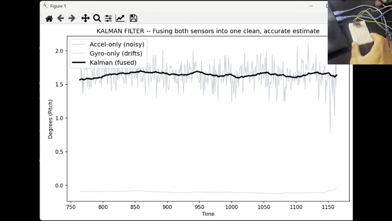
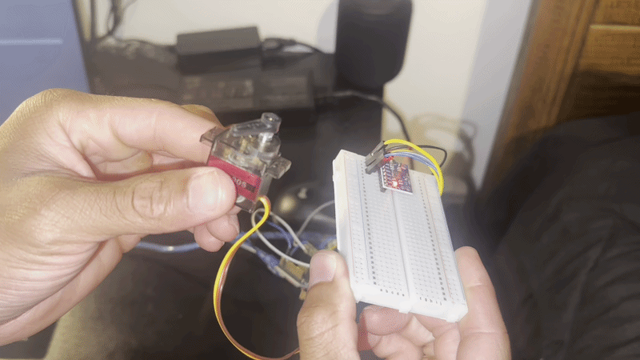
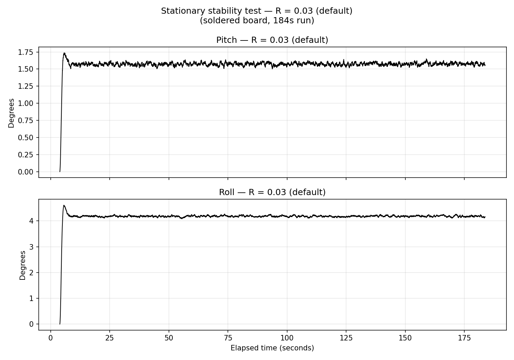
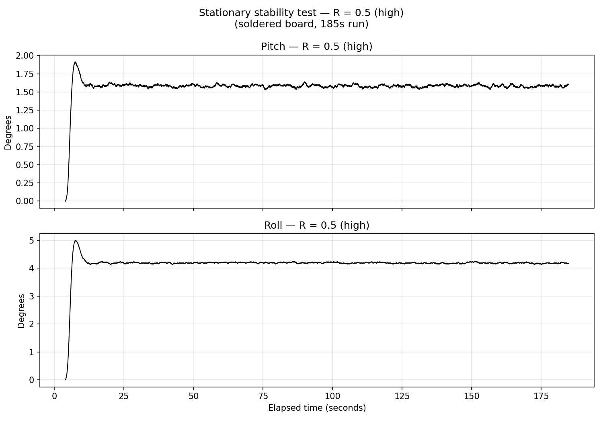
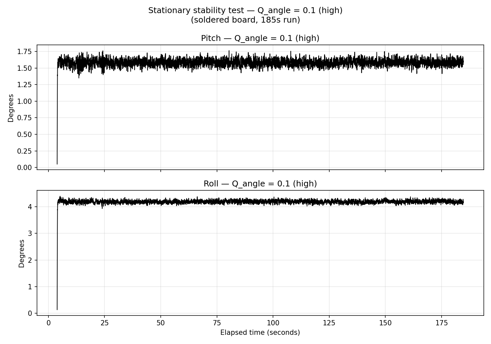
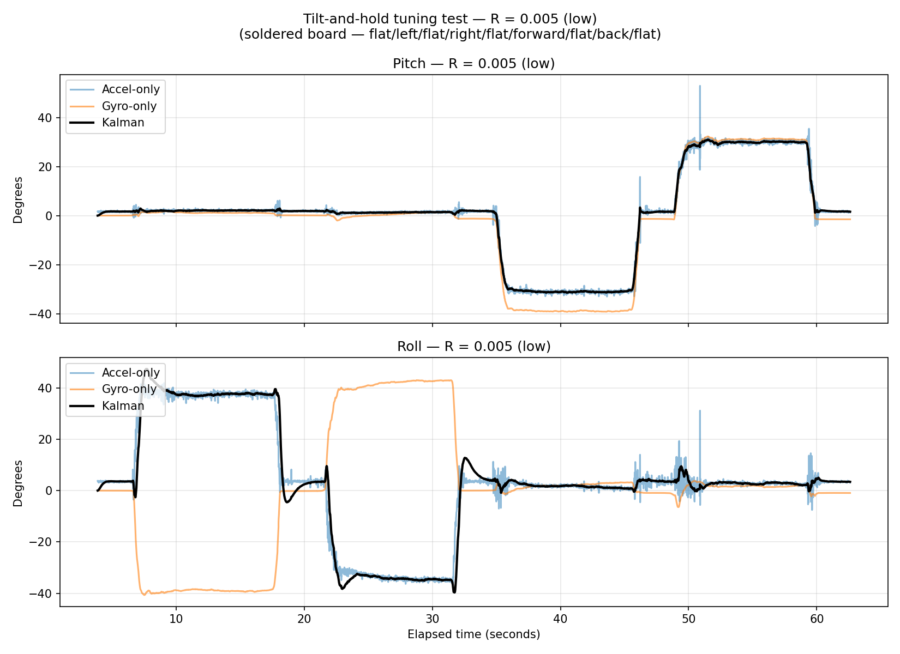
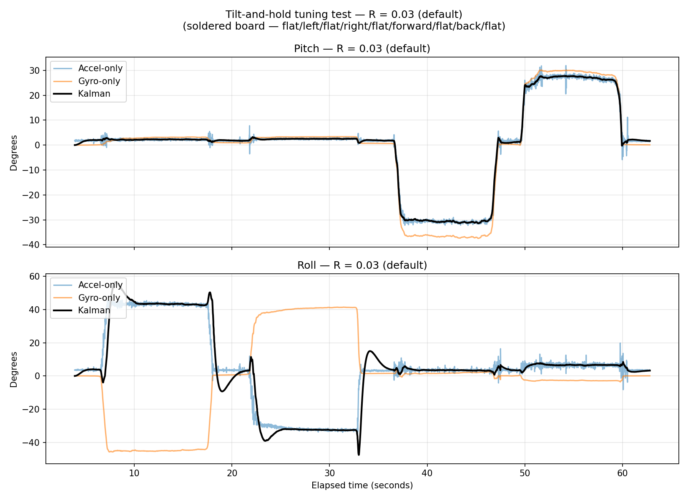
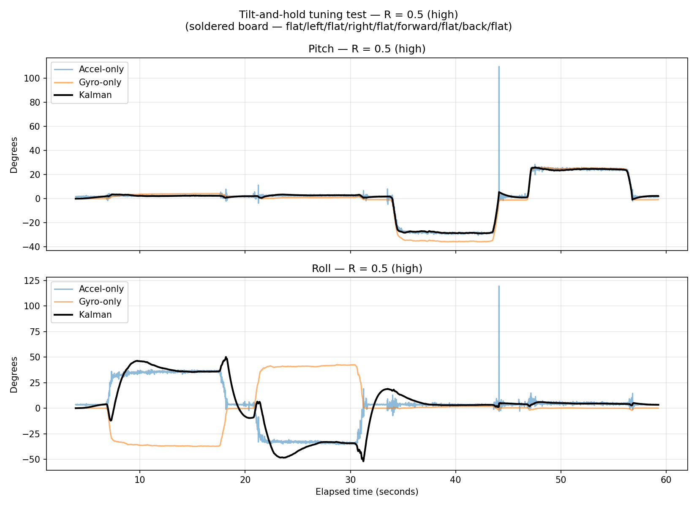
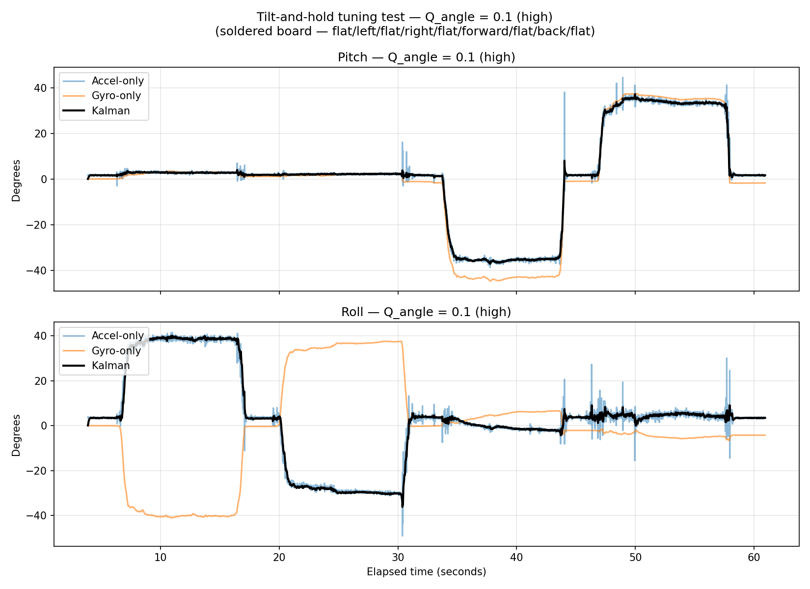

# IMU Orientation Tracker with Kalman Filter

A real-time, two-axis orientation tracker built from an MPU6050 IMU and an Arduino Nano, fusing noisy accelerometer and drifting gyroscope readings into a single stable estimate — then closing the loop by driving a servo to physically mirror the tracked tilt in real time.

Built to demonstrate state estimation and sensor fusion fundamentals — the specific gap between signal-processing/software experience and control-theory experience that matters for GNC and autonomy roles.

## Demo

**The problem — raw sensor data alone:**



Accelerometer (blue) jitters constantly even at a near-constant tilt; gyro-only (integrated, tan) slowly drifts away from the true angle over time — neither alone gives a clean, trustworthy estimate.

**The fix — Kalman-fused estimate:**



Same two raw signals (faded), with the fused Kalman estimate (black) riding a clean, stable path through the noise — responsive to real tilt, without the jitter or the drift.

**Closing the loop — servo mirrors the fused estimate in real time:**



The Kalman-fused pitch angle is sent back over serial to drive a servo, completing a full sense → estimate → act loop.

## The Problem

Two sensors, two different failure modes:

- **Gyroscope** measures rotation *rate* (deg/s), not angle. To get an angle, you integrate rate over time. Every reading carries a small amount of noise, and integration means that noise **accumulates** — even a perfectly still sensor drifts steadily off from the true angle over time, purely from summed error. This is real, measurable, and shows up in minutes, not hours.

- **Accelerometer** measures gravity's split across its axes, and calculates an angle fresh from that split every single reading — no memory of past readings, so **no drift**. But it's noisy moment-to-moment (hand tremor, vibration, anything that adds acceleration beyond gravity gets misread as tilt).

Neither sensor alone is usable for a stable, accurate, real-time angle. A Kalman filter blends them: lean on the gyro's smooth short-term estimate, continuously correct it against the accelerometer's noisy-but-honest long-term reference.

## Hardware

| Part | Notes |
|---|---|
| Arduino Nano (LAFVIN clone) | CH340 USB driver required; "Old Bootloader" processor setting needed for uploads to succeed |
| MPU6050 (GY-521 breakout) | 6-axis accel + gyro over I2C |
| Breadboard + jumper wires | |
| SG90 micro servo | Stretch goal — closes the loop from estimation into actuation |

**Development note:** early development used an MPU6050 with unsoldered header pins, wired directly/via breadboard rather than soldered — mechanically less reliable, and the source of occasional I2C dropouts and one intermittent roll-axis anomaly (see Limitations). The build now uses a pre-soldered board with a mechanically solid connection; the anomaly was re-tested and did not reproduce.

## Architecture

```
MPU6050 --I2C--> Arduino Nano --Serial (CSV, 100Hz)--> Python
                                                           │
                                            accel-only angle (atan2, noisy, no drift)
                                            gyro-only angle (integrated, smooth, drifts)
                                            Kalman-fused angle (KalmanFilter1D)
                                                           │
                                            Arduino <--Serial (angle command)-- Python
                                                           │
                                                      Servo mirrors tilt
```

Deliberate design choice: **the Kalman filter runs in Python, not on the Arduino.** The Arduino's job is precise, real-time I/O — sampling the sensor on a strict 100Hz timer, generating servo pulses — which is what it's built for. The filter math itself doesn't care where it runs, and Python offers far better tooling for developing and tuning it: fast iteration on Q/R values, live plotting, no reflashing required to test a change. Porting the filter to run on-Arduino (fixed-point, no numpy) would be a natural next step if this needed to run untethered from a laptop.

Firmware uses non-blocking `millis()`-based timing throughout (not `delay()`), so sensor sampling and incoming serial commands can both be serviced every loop pass without either blocking the other.

## The Math

**State vector:** `[angle, gyro_bias]` — tracking not just the angle, but the gyro's own residual bias, which lets the filter improve its bias estimate over time rather than relying on a single one-time calibration.

**Predict step** (each cycle, using the gyro):
```
rate = gyro_reading − bias
angle += dt * rate
```
Covariance (`P`) propagates forward too, representing growing uncertainty between corrections.

**Update step** (each cycle, using the accelerometer):
```
innovation = accel_angle − predicted_angle
K = P / (P + R)              # Kalman gain
angle += K * innovation
bias  += K * innovation
```

Two independent `KalmanFilter1D` instances run per cycle — one for pitch, one for roll — rather than a single coupled 2D/quaternion model. This is a deliberate scope decision: it's simpler to derive, tune, and defend than a full attitude representation, at the cost of some cross-axis inaccuracy during combined/tumbled motion (see Limitations).

## Tuning: Q and R

`R` (measurement noise) controls how much the filter trusts the accelerometer; `Q_angle` (process noise) controls how much it trusts its own gyro-based prediction. Four configurations were tested twice each on the soldered board: a 3-minute stationary hold (for precise noise measurement) and a 60-second tilt-and-hold sequence — flat, left, flat, right, flat, forward, flat, back, flat — covering both pitch and roll (plots below).

| Setting | Steady-state noise (std dev, stationary) | Observed behavior |
|---|---|---|
| R = 0.005 (low) | Pitch 0.47° / Roll 1.00° (mixed window) | Fast response, tracks accelerometer closely; visibly noisier than R=0.03 or R=0.5 |
| R = 0.03 (default) | Pitch 0.020° / Roll 0.026° | Balanced — filters individual noise spikes while tracking real motion promptly |
| R = 0.5 (high) | Pitch 0.017° / Roll 0.018° | Smoothest at rest; slower to converge from a cold start; visibly rejects short outlier spikes in the accelerometer (see tilt-test plot — a brief ~100° accelerometer spike from an incidental bump barely registers in the Kalman output) |
| Q_angle = 0.1 (high) | Pitch 0.045° / Roll 0.050° | Fast convergence, similar responsiveness to low R — but roughly **2x noisier at rest** than either R=0.03 or R=0.5, measured on a clean 3-minute stationary run. This corrects an earlier read from short tilt-test screenshots alone, which suggested Q_angle gave speed without a noise penalty; longer, higher-resolution stationary data shows that isn't the case. |

**Stationary stability tests (3-minute holds, confirming no drift on the soldered board):**
 



 
**Tilt-and-hold tuning comparison (flat/left/flat/right/flat/forward/flat/back/flat):**
 






## Limitations

- **Pitch and roll are computed independently and visibly bleed into each other during single-axis motion.** In every tilt-test plot, moving pitch alone (forward/back) produces small but real bumps in the roll estimate, and vice versa — visible directly in the recorded data, not just theoretical. Each axis's angle comes from splitting gravity's pull across a pair of accelerometer axes independently; a full 3D representation (quaternions, or a 9-axis fusion with a magnetometer) would resolve this. Out of scope for this build.
- **Yaw is not tracked at all.** An accelerometer fundamentally cannot sense rotation about the vertical axis — gravity's split across the sensor's axes doesn't change during a flat spin, so there's no reference to correct a yaw estimate against. Would require a magnetometer.
- **Resolved during development — noted here for the record:** an earlier build using an unsoldered sensor connection showed an apparent roll-axis drift under conservative filter tuning (R = 0.5), while pitch remained stable under the same conditions. This was re-tested after switching to a soldered connection, across three separate ~3-minute stationary runs (R = 0.03, R = 0.5, Q_angle = 0.1, ~18,000 samples each) — roll held flat and stable in every case, including at R = 0.5, the exact setting that originally showed the problem. The original finding is attributed to intermittent I2C signal integrity on the unsoldered connection rather than a true gyro bias asymmetry between axes.

## Repository Structure

```
imu-kalman-tracker/
├── firmware/
│   └── imu_servo_firmware.ino     # Arduino: sensor streaming + servo control, I2C timeout handling
├── python/
│   ├── kalman.py                   # KalmanFilter1D class, standalone + runnable sanity check
│   ├── serial_reader_2axis.py      # Live pitch/roll estimation, servo command output with deadband
│   ├── live_plot_2axis.py          # Real-time matplotlib visualization, both axes
│   ├── plot_drift_tests.py         # Generates the 3-minute stationary stability plots from raw_logs CSVs
│   └── plot_tuning_tests.py        # Generates the tilt-and-hold tuning comparison plots from raw_logs CSVs
├── data/
│   ├── raw.gif, filtered.gif, servo.gif
│   ├── *_stability_plot.png        # 3 stationary drift-test plots (R=0.03, R=0.5, Q_angle=0.1)
│   ├── *_tilted_plot.png           # 4 tilt-and-hold tuning plots (R=0.005/0.03/0.5, Q_angle=0.1)
│   └── raw_logs/                   # Source CSVs behind every plot above -- fully reproducible
├── .gitignore
├── requirements.txt
└── README.md
```

## Running It

**Live, with hardware connected:**
1. Upload `firmware/imu_servo_firmware.ino` to the Arduino (Board: Nano, Processor: ATmega328P Old Bootloader if upload fails)
2. `pip install -r requirements.txt`
3. Edit `SERIAL_PORT` in the Python script to match your board
4. Close any open Serial Monitor/Plotter (only one program can hold the port at a time)
5. Run `python3 python/serial_reader_2axis.py` (text output) or `live_plot_2axis.py` (graph)

**Regenerating the tuning/stability plots from recorded data (no hardware needed):**
1. `pip install -r requirements.txt` (includes pandas, used only by these two scripts)
2. From `python/`, run `python3 plot_drift_tests.py` or `python3 plot_tuning_tests.py`
3. Both scripts read their source CSVs from `data/raw_logs/` and save PNG plots directly — no live sensor connection required, since they work entirely from the already-recorded test data

## What's Next

- Demo video showing raw-vs-filtered comparison and the servo tracking live motion
- Possible future extension: magnetometer for yaw, or a full quaternion-based attitude filter
